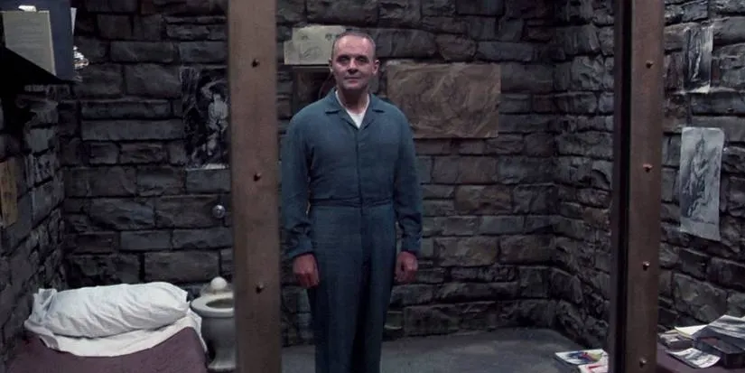

# Crop_circle_image
This module provides functionality to crop a circular region of interest (ROI) from an image.
It includes a demonstration script that allows users to specify the image path, circle center coordinates, and radius 
via command-line arguments. The cropped circular region is saved as a new image file.

## Dependencies:
- Python 3.x
- OpenCV
- NumPy

## Usage Examples
### Default parameters:
```bash
python crop_circle.py
```

### Grayscale image:
```bash
python crop_circle.py --image hannibal_lecter_gray.png
```

### Custom coordinates and image:
```bash
python crop_circle.py --image <path_to_image> --x <x_coordinate> --y <y_coordinate> --r <circle_radius>
```

### Help:
```bash
python crop_circle.py --help
```

## Demonstration

Input:

<p align="center">
 
</p>

Output:

<p align="center">
  
</p>